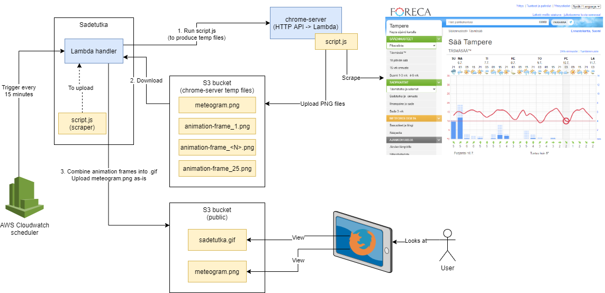

What?
-----

I wanted to display local weather + animated rain map in my home automation dashboard.
There was no clean integration via data layer, so I had to resort to browser-based
scraping (because I didn't want to use an `iframe` either)

This runs on AWS Lambda.

It basically produces these images:

**IMPORTANT!** If you're planning on linking to these files, **do not copy GitHub's camo URL directly!**
[It'll prevent caching and cost me unnecessary bandwidth](https://joonas.fi/2021/02/locating-costly-aws-s3-buckets/)!
The raw URLs are:

https://function61.com/files/sadetutka/meteogram.png?utm_source=gh

https://function61.com/files/sadetutka/latest.gif?utm_source=gh

Source data for images
----------------------

From data in [https://www.foreca.fi/Finland/Tampere](https://www.foreca.fi/Finland/Tampere)

How?
----

Internally, this uses [chrome-server](https://github.com/function61/chrome-server)
microservice (also runs on Lambda, but it's behind a standard HTTP API).

Why is this public?
-------------------

I shared this not because it's ready-to-use for anybody else, but in the hopes if the
techniques help anybody else.

Debug
-----

If the script has broken, run `$ bob dev` and it'll give you pro-tips for debugging.
